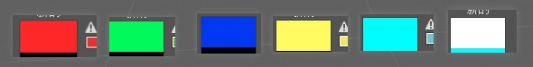
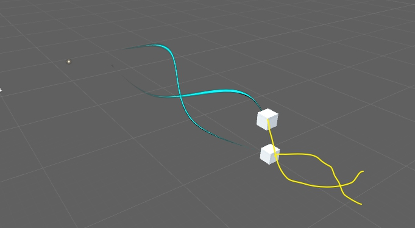
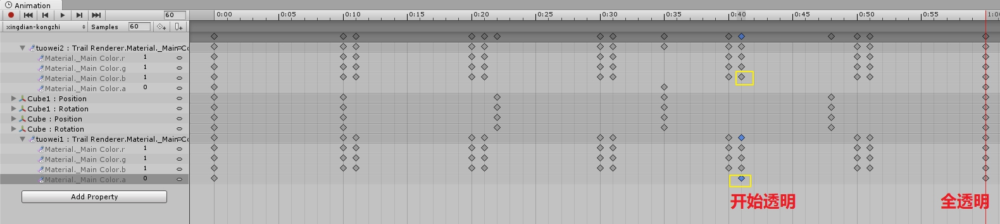
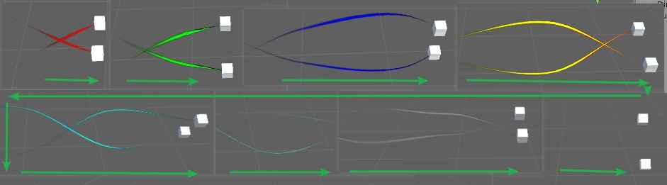
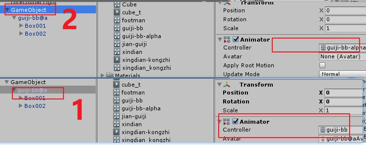
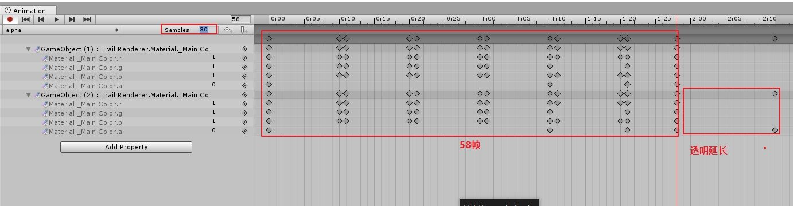
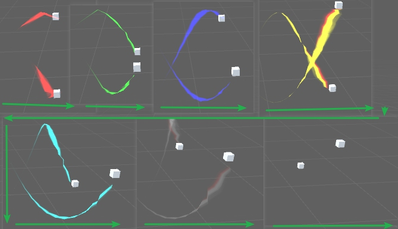

# 拖尾动画

### 说明
1.  问题：实际测试中，拖尾挂接到max导出fbx 运动轨迹，透明key帧 总是对不上，出现一会儿透明一会不透明的现象，但是如果该轨迹在unity中key帧，并在同一个动画控制器中制作透明 验证有效。
2.  原因： 通过测试研究 知道，max中fbx 导出动画帧速率通常是30. 而unity 默认帧速率是60 ，导致问题出现。 
3.  解决方法： 首先 如果轨迹动画不涉及到骨骼绑定 还是建议在unity中key帧，挂接拖尾，给拖尾key透明。 如果拖尾一定要挂接到骨骼动画上，
    1.  拖尾播放帧速率修改和 骨骼动画一样
    2.  通常在动画停止时候，拖尾动画此时会进行下一个循环播放，解决方法是，利用透明动画帧进行控制，特效动画要长于骨骼动画一些， 具体长多少，要看效果来决定。

### 结论：
##### 定义一下： 
+ max中导出fbx骨骼动画 = fbx动画
+ unity中直接给物体key基本变换动画= unity动画  
##### 拖尾在挂接到fbx动画 unity动画都可以情况下，优先使用 unity动画，必须挂接到fbx动画，要求修改拖尾动画播放帧速率=fbx动画帧速率，针对fbx动画停止后拖尾逻辑对不上问题，可以增加拖尾动画帧利用透明解决。

### 实例说明
1. unity中key物体动画+拖尾实例 
   + 动画说明： 螺线轨迹动画时间是58帧。key了染色动画+透明动画，依次播放 红 绿蓝黄青 白 播放到   青 开始透明 到 白 完成全透明。  
    
    
   + 动画列表
     +  动画列表 物体变换 时间和拖尾时间一致  
    
   +  逻辑验证ok(在青开始透明) 
    
      + 没有骨骼动画推荐使用该种方式 由于物体变换+特效都在一个控制器中，方便查询预览

2. unity中播放fbx动画+拖尾实例 
   +  动画说明： 螺线轨迹动画时间是58帧。key了染色动画+透明动画，依次播放 红 绿蓝黄青 白 播放到   青 开始透明 到 白 完成全透明。
    
    

   + fbx动画和直接unitykey帧不同
     
      + 1.fbx动画，导入unity不能修改，拖尾动画不能和fbx动画共用一个动画控制器
      + 2.在特效最顶层加入动画控制器，控制拖尾 染色+ 透明逻辑。

    + 动画列表
        + 要求帧速率修改成 30 ，同步fbx动画。
        +  同样表达从青开始透明到白全透明，透明帧要长一些，具体看效果。
        +  最后多余帧要求a通道完全是0，防止在拖尾回收过程中产生的新的轨迹会显示出来。
       
       
    +  逻辑验证ok(在青开始透明) 
    